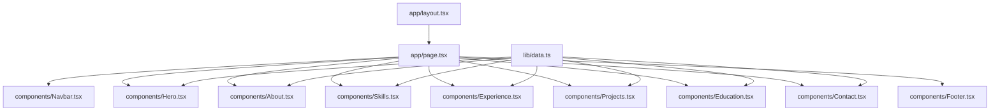
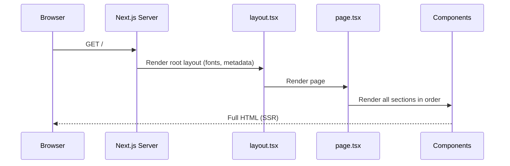
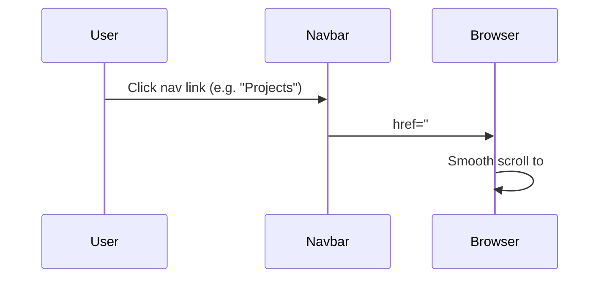

# Design Document: Ansul Joshi Portfolio Website

## Overview

A bold, editorial-style personal portfolio website for Ansul Joshi — a full-stack web developer. The design is inspired by the Arda Güler athlete website aesthetic: massive red typography, clean white backgrounds, strong typographic hierarchy, and a minimal layout that lets the content breathe. Built with Next.js 15 (App Router) and Tailwind CSS 4.

The site is a single-page experience with smooth scroll navigation, presenting Ansul's identity, skills, experience, projects, and contact information in a visually striking, modern format.

---

## Architecture



All components are React Server Components by default. No client-side state is needed except for the mobile menu toggle (one `"use client"` component).

---

## Sequence Diagrams

### Page Load Flow



### Navigation Scroll Flow



---

## Components and Interfaces

### Component: Navbar

**Purpose**: Fixed top navigation bar with name/title on left, nav links on right. Collapses to hamburger on mobile.

**Interface**:
```typescript
// No props — reads from data.ts internally
export default function Navbar(): JSX.Element
```

**Responsibilities**:
- Display "ANSUL JOSHI" and "Full-Stack Developer" on the left
- Display nav links: About, Skills, Experience, Projects, Contact on the right
- Sticky positioning with subtle backdrop blur on scroll
- Mobile hamburger menu (client component)

---

### Component: Hero

**Purpose**: Full-viewport hero section. The name "ANSUL JOSHI" is displayed in massive bold red condensed type, dominating the screen.

**Interface**:
```typescript
interface HeroProps {
  name: string        // "ANSUL JOSHI"
  tagline: string     // "Full-Stack Web Developer"
  quote: string       // Summary/tagline sentence
}
export default function Hero(props: HeroProps): JSX.Element
```

**Responsibilities**:
- Render name in massive red typography (fluid font size, ~15–20vw)
- Display tagline and a short punchy quote below
- Include a CTA button "View My Work" linking to #projects
- Include a secondary link "Get In Touch" linking to #contact
- Decorative red accent line / geometric element

---

### Component: About

**Purpose**: Brief personal summary section with a clean editorial layout.

**Interface**:
```typescript
interface AboutProps {
  summary: string
  location: string
}
export default function About(props: AboutProps): JSX.Element
```

**Responsibilities**:
- Display section label "01 — ABOUT"
- Render summary paragraph in large readable type
- Show location badge

---

### Component: Skills

**Purpose**: Display technical skills grouped by category in card-style blocks.

**Interface**:
```typescript
interface SkillCategory {
  category: string    // e.g. "Languages"
  items: string[]     // e.g. ["Java", "Python", "PHP"]
}
interface SkillsProps {
  skills: SkillCategory[]
}
export default function Skills(props: SkillsProps): JSX.Element
```

**Responsibilities**:
- Display section label "02 — SKILLS"
- Render each category as a card with bold category name and pill/tag items
- Use red accent for category labels
- Responsive grid layout (1 col mobile → 2 col tablet → 3 col desktop)

---

### Component: Experience

**Purpose**: Work experience timeline with company, role, dates, and bullet points.

**Interface**:
```typescript
interface ExperienceItem {
  role: string
  company: string
  period: string
  bullets: string[]
}
interface ExperienceProps {
  items: ExperienceItem[]
}
export default function Experience(props: ExperienceProps): JSX.Element
```

**Responsibilities**:
- Display section label "03 — EXPERIENCE"
- Render each role as a large editorial block
- Role title in bold black, company in red, period in gray
- Bullet points with red dash markers

---

### Component: Projects

**Purpose**: Showcase three key projects in card-style blocks.

**Interface**:
```typescript
interface Project {
  name: string
  description: string
  tech: string[]
  highlight?: string   // Optional one-line highlight
}
interface ProjectsProps {
  projects: Project[]
}
export default function Projects(props: ProjectsProps): JSX.Element
```

**Responsibilities**:
- Display section label "04 — PROJECTS"
- Render each project as a bold card with project number, name, tech stack tags, and description
- Hover state: red left border accent
- Responsive grid (1 col → 3 col)

---

### Component: Education

**Purpose**: Education and certifications section.

**Interface**:
```typescript
interface EducationItem {
  degree: string
  institution: string
  period: string
}
interface Certification {
  title: string
  provider: string
}
interface EducationProps {
  education: EducationItem[]
  certifications: Certification[]
}
export default function Education(props: EducationProps): JSX.Element
```

**Responsibilities**:
- Display section label "05 — EDUCATION"
- Show degree, institution, and period
- List certifications with provider

---

### Component: Contact

**Purpose**: Contact section with links and email.

**Interface**:
```typescript
interface ContactProps {
  email: string
  phone: string
  linkedin: string
  github: string
  location: string
}
export default function Contact(props: ContactProps): JSX.Element
```

**Responsibilities**:
- Display section label "06 — CONTACT"
- Large "LET'S WORK TOGETHER" heading in red
- Display email as a large clickable link
- Show GitHub, LinkedIn, phone, and location as icon+text rows

---

### Component: Footer

**Purpose**: Minimal footer with copyright.

**Interface**:
```typescript
export default function Footer(): JSX.Element
```

---

## Data Models

### `lib/data.ts` — Central data store

```typescript
export const personalInfo = {
  name: "ANSUL JOSHI",
  tagline: "Full-Stack Web Developer",
  quote: "Building end-to-end solutions — from database design to UI.",
  email: "ansuljoshi144@gmail.com",
  phone: "+91-7021112899",
  linkedin: "https://linkedin.com/in/ansuljoshi",
  github: "https://github.com/Ansul-Joshi",
  location: "Panvel, Maharashtra",
  summary: "Full-stack web developer with hands-on experience building and deploying responsive web applications across Java, PHP, and Python stacks. Proven ability to deliver end-to-end solutions – from database design to UI – across academic, NGO, and warehouse domains. Adept at integrating third-party APIs, AI services, and automation tools in production environments."
}

export const skills: SkillCategory[] = [
  { category: "Languages", items: ["Java", "Python", "PHP", "JavaScript", "SQL"] },
  { category: "Frontend", items: ["HTML5", "CSS3", "Bootstrap", "React", "jQuery"] },
  { category: "Backend", items: ["Java Servlets", "JSP", "PHP (PDO/MVC)", "Python (Eel, pyttsx3)"] },
  { category: "Databases", items: ["MySQL", "MongoDB", "SQLite", "Oracle"] },
  { category: "Tools & Platforms", items: ["Git", "GitHub", "Apache Tomcat", "Eclipse IDE", "n8n", "WordPress", "Shopify", "Google Cloud", "AWS"] },
  { category: "AI / APIs", items: ["Google Gemini API", "Google Speech Recognition", "Generative AI integration"] }
]

export const experience: ExperienceItem[] = [
  {
    role: "Web Developer",
    company: "KS Softech",
    period: "Apr 2025 – Oct 2025",
    bullets: [
      "Built and maintained responsive client websites using HTML, CSS, JavaScript, and PHP",
      "Developed and customized WordPress and Shopify storefronts; automated multi-step marketing workflows via n8n and Klaviyo",
      "Optimized on-page content and site architecture for SEO"
    ]
  },
  {
    role: "Web Developer Intern",
    company: "Healing Up NGO",
    period: "Jun 2024 – Feb 2025",
    bullets: [
      "Designed and deployed a fully responsive website for an NGO",
      "Integrated third-party APIs for donation and contact workflows"
    ]
  }
]

export const projects: Project[] = [
  {
    name: "Acadify",
    description: "Academic & Attendance Management System — full-stack web app for managing student records, attendance, and academic data.",
    tech: ["Java", "JSP", "Servlets", "MySQL", "Maven"]
  },
  {
    name: "Warehouse Management System",
    description: "Inventory and warehouse operations platform with admin dashboard, product tracking, and reporting.",
    tech: ["PHP", "MySQL", "Bootstrap 5", "AdminLTE", "PDO"]
  },
  {
    name: "Jitter",
    description: "AI-powered voice assistant with natural language processing, text-to-speech, and Gemini AI integration.",
    tech: ["Python", "Eel", "pyttsx3", "Gemini API", "HTML/CSS/JS"]
  }
]

export const education: EducationItem[] = [
  {
    degree: "Bachelor of Science – Computer Science",
    institution: "Pillai College of Arts, Commerce and Science",
    period: "2023 – 2025"
  }
]

export const certifications: Certification[] = [
  { title: "Build Responsive Real-World Websites with HTML and CSS", provider: "Udemy" },
  { title: "100 Days of Code: The Complete Python Pro Bootcamp", provider: "Udemy" }
]
```

---

## Algorithmic Pseudocode

### Page Rendering Algorithm

```pascal
ALGORITHM renderPortfolioPage()
INPUT: none
OUTPUT: HTML page

BEGIN
  data ← importFrom("lib/data.ts")
  
  RENDER layout(
    fonts: [Barlow_Condensed, Inter],
    metadata: { title: "Ansul Joshi — Full-Stack Developer" }
  )
  
  RENDER Navbar()
  
  RENDER Hero(
    name: data.personalInfo.name,
    tagline: data.personalInfo.tagline,
    quote: data.personalInfo.quote
  )
  
  FOR EACH section IN [About, Skills, Experience, Projects, Education, Contact] DO
    RENDER section(relevantData)
  END FOR
  
  RENDER Footer()
END
```

### Mobile Menu Toggle Algorithm

```pascal
ALGORITHM MobileMenu()
STATE: isOpen ← false

BEGIN
  RENDER hamburger button
  
  ON click DO
    isOpen ← NOT isOpen
  END ON
  
  IF isOpen THEN
    RENDER full-screen nav overlay with links
  END IF
END
```

---

## Key Functions with Formal Specifications

### `cn(...classes)` — Class name utility

```typescript
function cn(...classes: (string | undefined | false | null)[]): string
```

**Preconditions**: Arguments are strings, undefined, false, or null  
**Postconditions**: Returns a single space-joined string of truthy class values  
**Loop Invariants**: All processed classes are valid strings or filtered out

---

## Correctness Properties

- For all sections, the section ID must match the corresponding navbar anchor href
- For all skill categories, `items.length >= 1`
- For all experience items, `bullets.length >= 1`
- For all projects, `tech.length >= 1`
- The Hero section must always render the name in red (`#E30613`) at a minimum font size of `10vw`
- Navigation links must be reachable via keyboard (tab order)
- All external links (LinkedIn, GitHub) must have `target="_blank"` and `rel="noopener noreferrer"`
- Color contrast ratio between red `#E30613` and white `#FFFFFF` must meet WCAG AA for large text

---

## Error Handling

### Missing Data Fields

**Condition**: A data field in `lib/data.ts` is empty or undefined  
**Response**: TypeScript compile-time error via strict typing — no runtime failures  
**Recovery**: Fix data at source; all fields are required by type definitions

### Font Loading Failure

**Condition**: Google Fonts CDN unavailable  
**Response**: Next.js font system falls back to system sans-serif fonts  
**Recovery**: Automatic — no user action needed

---

## Testing Strategy

### Unit Testing Approach

Each component can be tested in isolation by passing mock data matching the TypeScript interfaces. Key assertions:
- Hero renders name in an element with red color class
- Skills renders correct number of category cards
- Experience renders correct number of role blocks
- All nav links have correct `href` anchors

### Property-Based Testing Approach

**Property Test Library**: fast-check

- For any valid `SkillCategory[]`, Skills component renders exactly `skills.length` category cards
- For any valid `ExperienceItem[]`, Experience renders exactly `items.length` role blocks
- For any non-empty string `name`, Hero renders it in a heading element

### Integration Testing Approach

- Full page render test: all 6 section IDs (`#about`, `#skills`, `#experience`, `#projects`, `#education`, `#contact`) are present in the DOM
- Navbar links resolve to correct section anchors

---

## Performance Considerations

- All components are React Server Components (zero client JS except mobile menu)
- Fonts loaded via `next/font/google` with `display: swap` — no layout shift
- No images in initial design (text-only) — instant LCP
- Tailwind CSS 4 purges unused styles at build time — minimal CSS bundle

---

## Security Considerations

- No user input forms — no XSS surface
- All external links use `rel="noopener noreferrer"` to prevent tab-napping
- No API routes or server actions — static content only
- Contact email rendered as `mailto:` link — no server-side email handling

---

## Dependencies

| Package | Version | Purpose |
|---|---|---|
| next | 16.2.6 | Framework |
| react | 19.2.4 | UI library |
| tailwindcss | ^4 | Styling |
| @tailwindcss/postcss | ^4 | PostCSS integration |
| typescript | ^5 | Type safety |
| next/font | built-in | Google Fonts (Barlow Condensed, Inter) |
